# 动漫个性推荐小程序

## 1.目的及意义
> 针对动漫产业蓬勃发展，而动漫资讯参差不齐，用户难以获取优质动漫信息的问题，该文设计并实现了动漫个性化推荐小程序，提出了动漫个性化推荐算法，为用户推荐个性化的优质动漫内容，提高了用户获取优质动漫的效率，从而解决了用户难以获取优质动漫信息的问题。用户使用动漫个性化推荐小程序，去了解动漫热门榜单或搜索动漫信息，进行动漫收藏、评分、评论或分享操作。动漫个性化算法会基于用户的收藏、分享记录和评分行为，生成用户画像。将用户画像与动漫属性相关联，推荐用户兴趣相符的动漫。将不同用户的用户画像进行比对，匹配兴趣相似的用户，推荐用户可能感兴趣的新内容。使用动漫个性化推荐小程序比起传统动漫资讯软件，用户更能找到符合自身兴趣的动漫。

## 2.技术栈
|系统|技术|
|:--:|:--:|
|前台|微信原生小程序|
|后台|Vue2|
|服务器|Express4|
|数据库|MySql|

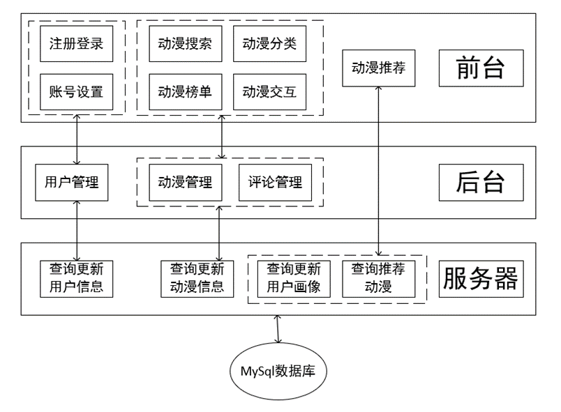

## 3.系统功能模块图

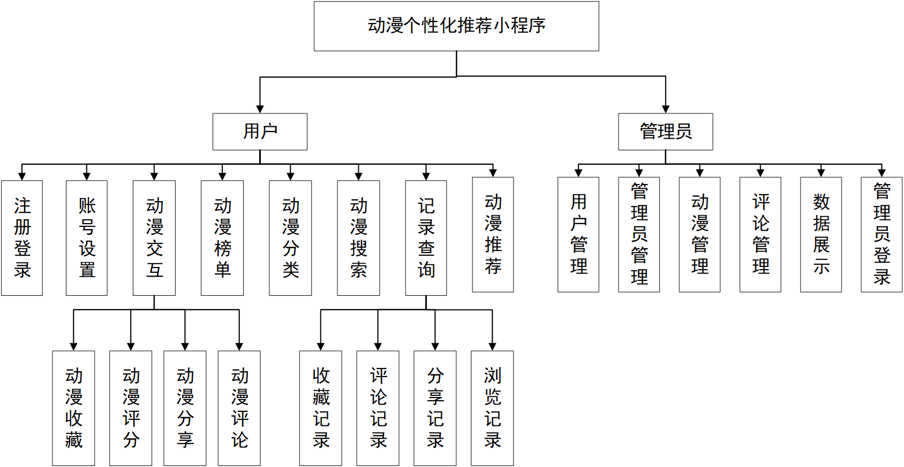

## 4.系统功能介绍
系统的功能将被分成前台和后台两部分。
- 前台的功能为：

1.	注册登录：用户可以注册账号进行登录系统，也可以选择直接微信登录系统。
2.	账号设置：用户可以设置账号头像，也可以修改用户密码。
3.	动漫榜单：动漫榜单展示各种评分高的动漫，用户可以了解最新动漫信息。
4.	动漫搜索：用户可以通过动漫名、作者或分类等信息进行搜索查询动漫，搜索结果显示所有近似的相关动漫。
5.	动漫分类：用户可以浏览各个类型的动漫，浏览时可以设置多个详细的筛选条件进一步查找想看的动漫类型。
6.	动漫交互：用户可以选择动漫查看动漫详情，如动漫地区、年份、类型、简介或评论。对动漫还可以进行评分、收藏、分享和评论。
7.	记录查询：当用户操作完动漫后想查看操作记录，可以查找收藏记录、浏览记录、评论记录或分享记录进行查看。
8.	动漫推荐：据用户的喜好偏向、搜索浏览行为和参与打分留言收藏等行为，分析用户可能喜欢的动漫，并对用户进行个性化推荐动漫。
- 后台功能为：

1.	管理员登录：管理员可以获取账号登录后台管理系统，进行管理员操作。
2.	数据展示：管理员登录后可以查看系统数据，如账号数据、用户数、动漫数、用户占比图、动漫类型图等。
3.	用户管理：所有用户信息将展示出来，管理员可以搜索用户、新增用户、重置用户密码、删除用户。
4.	管理员管理：所有的管理员账户将展示出来，管理员可以搜索管理员账户、新增管理员账户、重置管理员密码、删除管理员账户。
5.	动漫管理：所有的动漫信息将展示出来，管理员可以搜索动漫、新增动漫、修改动漫、删除动漫
6.	评论管理：所有的评论将展示出来，管理员可以查看评论，删除评论。

## 5.系统截图

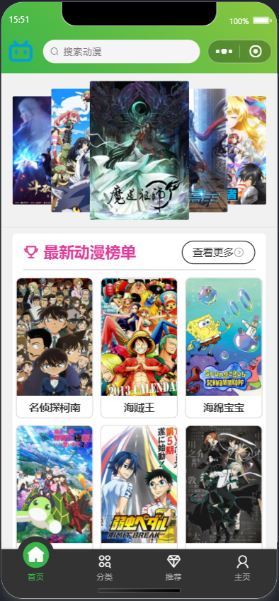

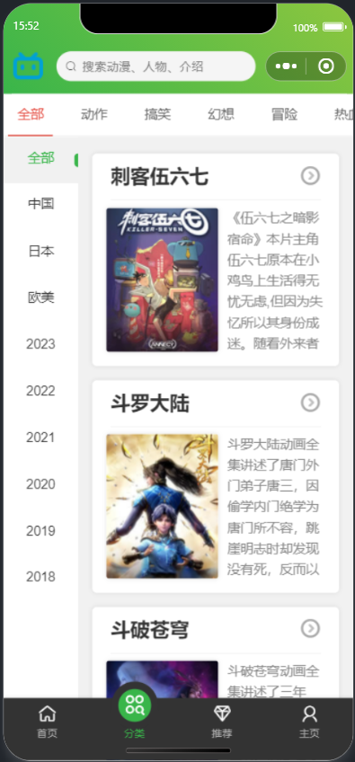

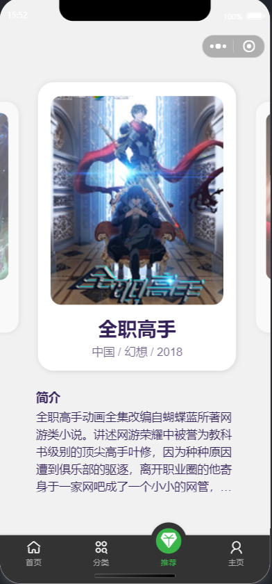

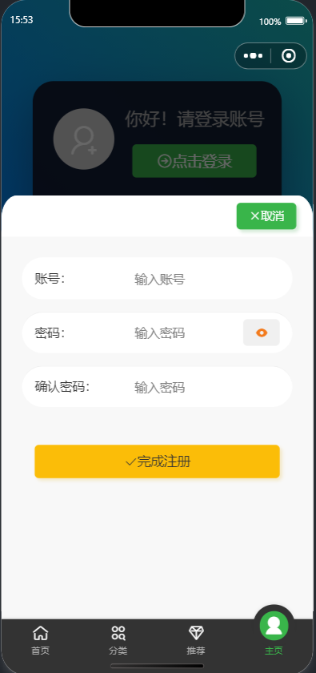

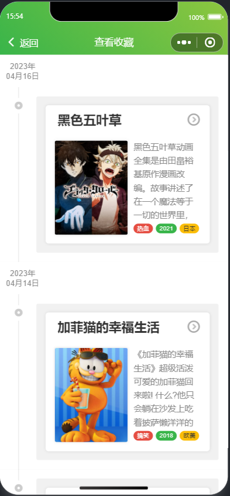

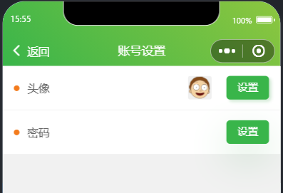

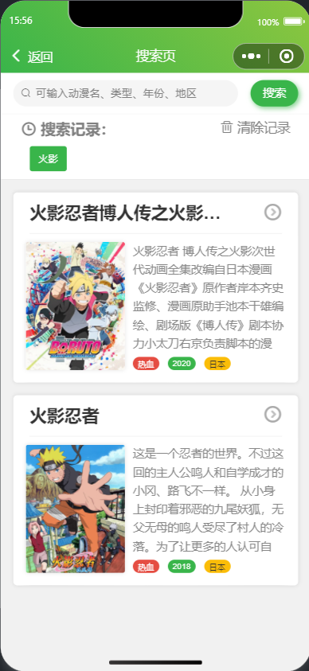

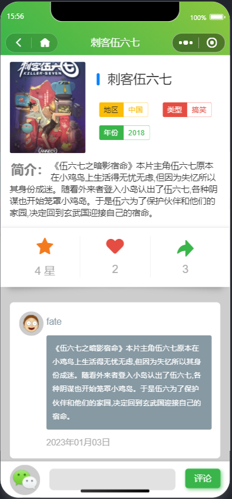

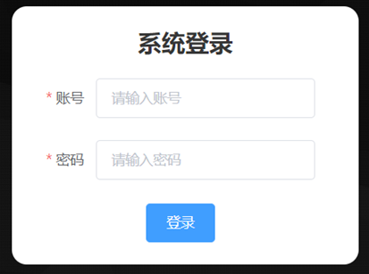

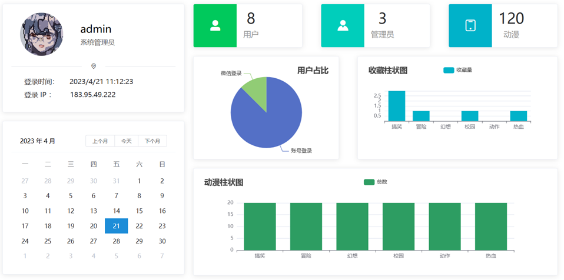

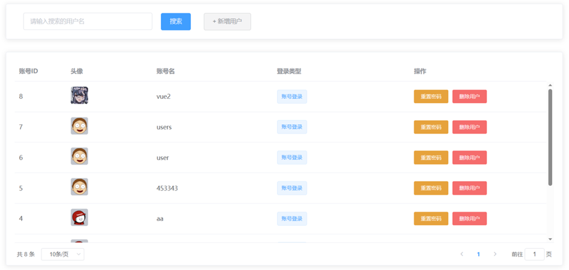

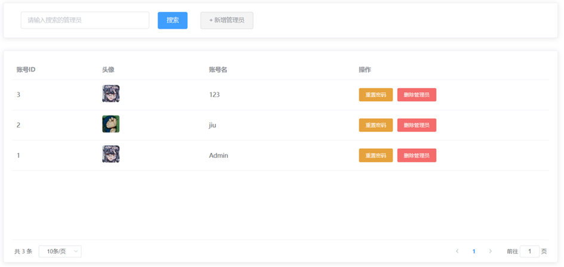

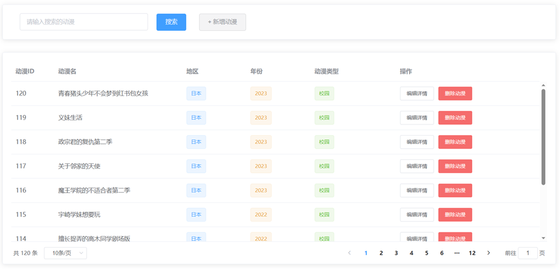

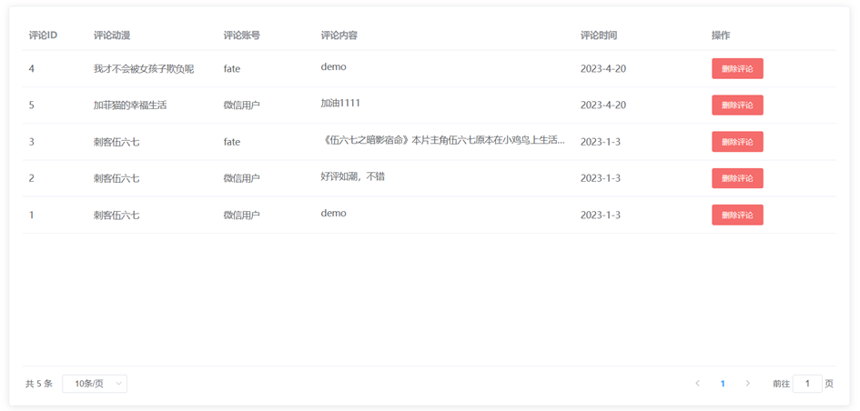
